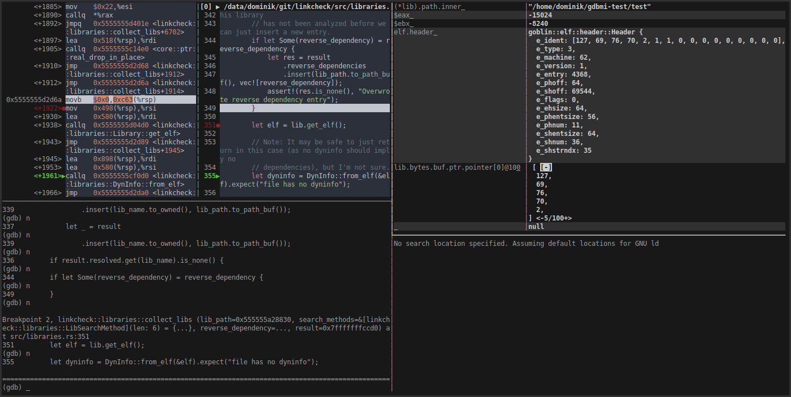
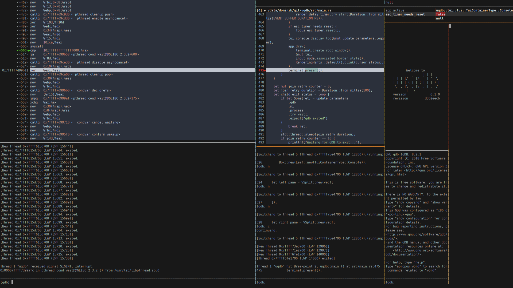

# ugdb

ugdb is an [unsegen](https://github.com/ftilde/unsegen) based alternative TUI for [gdb](https://www.gnu.org/software/gdb/).

## Screenshots


Oh, and in case you were wondering: Yes, you can totally use `ugdb` to debug `ugdb` debugging `ugdb`.


## Building

ugdb is written in Rust and needs a working installation of cargo to build.

```
$ git clone https://github.com/ftilde/ugdb
$ cd ugdb
$ cargo build --release
$ target/release/ugdb
```

## Usage

The command line interface is aimed to be *mostly* compatible with gdb:
```
$ ugdb --help
ugdb 0.1.0
ftilde <ftilde@protonmail.com>
An unsegen-based GDB frontend.

USAGE:
    ugdb [FLAGS] [OPTIONS] [program]...

FLAGS:
    -h, --help       Prints help information
        --nh         Do not execute commands from ~/.gdbinit.
    -n, --nx         Do not execute commands from any .gdbinit initialization files.
    -q, --quiet      "Quiet".  Do not print the introductory and copyright messages.  These messages are also suppressed
                     in batch mode.
    -V, --version    Prints version information

OPTIONS:
    -b <bps>                        Set the line speed (baud rate or bits per second) of any serial interface used by
                                    GDB for remote debugging.
        --cd <cd>                   Run GDB using directory as its working directory, instead of the current directory.
    -x, --command <command_file>    Execute GDB commands from file.
    -c, --core <core_file>          Use file file as a core dump to examine.
        --gdb <gdb_path>            Path to alternative gdb binary. [default: gdb]
        --log_dir <log_dir>         Directory in which the log file will be stored [default: /tmp]
    -p, --pid <proc_id>             Attach to process with given id.
    -d, --directory <source_dir>    Add directory to the path to search for source files.
    -s, --symbols <symbol_file>     Read symbols from the given file.

ARGS:
    <program>...    Path to program to debug (with arguments).
```

Some notable differences:

* Command line arguments to the program to be debugged can be specified without the `-a`-flag of gdb. (But don't forget `--`!)
* You can specify an alternative gdb via the `--gdb` argument. Go debug your Rust: `$ ugdb --gdb=rust-gdb`! By default, `gdb` in `$PATH` will be used.
* An alternative log file directory can be specified using `--log_dir` argument. By default, log files are created in `/tmp/`.
* Some flags might be missing either because they make now sense (e.g., `--tui`) or because I forgot to add them. In the latter case feel free to open an issue.


## User interface
The interface consists of 4 containers between which the user can switch with vim-like controls:
To enter selection mode, press `ESC` (indicated by orange separators).
You can then navigate between containers using arrow keys or hjkl.
Press `Enter` to enter *insert*-mode and interact with the selected container.
Alternatively press the shortcut key for the specific container to directly enter it (see below) from selection mode.

### GDB console

Interact using the standard gdb interface. Enter by pressing `i`.

* `PageUp`/`PageDown` scroll the output of the console.
* `Ctrl-B`/`Ctrl-E` jump to the beginning/end of the buffer.
* Use arrow keys/Backspace/`Home`/`End` to navigate the prompt.
* Characters are inserted at the cursor position.

### Pager

View and browse source code or assembly around the current program location. Enter by pressing `s`.

* Scroll up/down using arrow keys or jk and jump using `Home`/`End`.
* Navigate the stack using `PageUp`/`PageDown`.
* Use `Space` to toggle breakpoints at the current location in the pager.
* Toggle between source, assembly, and side-by-side mode using `d` (if available).

### Expression table

View and watch the (structured) results of gdb expressions (everything you can put after `p` in the console).
Changes between steps are highlighted.
Enter by pressing `e`.

* Enter an expression in the left column
* Press `Enter` to advance to the next row to enter another expression.
* Navigate using arrow keys.
* Use `Space` in the left column to interact with the structure viewer.

Note: The viewer is somewhat broken for displaying structures with custom pretty-printers.
A workaround would be to use [variable objects](https://sourceware.org/gdb/onlinedocs/gdb/GDB_002fMI-Variable-Objects.html), but that would not allow for evaluation of arbitrary expressions.

### Terminal

The tty of the program to be debugged is automatically redirected to this virtual terminal.
Enter by pressing `t`, or press `T` for *locked mode*.
Locked mode can only be exited by pressing `Esc` twice in rapid succession.
All other input is directly sent to the virtual terminal.
However, for most application the regular insert mode is sufficient and can be left by a single press of `Esc`.

* Scroll up/down using `PageUp`/`PageDown`.
* `Home`/`End` directly jump to the beginning/end of the output.

The virtual terminal does not yet properly implement all ansi functions, but it quite usable for a number of terminal applications.

## IPC Interface

`ugdb` can be controlled remotely via a unix domain socket-based (undocumented, quite limited) IPC interface.
In practice this means that you can install [vim-ugdb](https://github.com/ftilde/vim-ugdb) and set breakpoints in ugdb from vim using the `UGDBBreakpoint` command.

## Some notes on the status

This project mostly scratches my own itch -- successfully. I use it as my primary debugger. I that sense I consider this project as "done", but additional sub-itches may be sub-scratched in the future.

## Licensing

`ugdb` is released under the MIT license.
